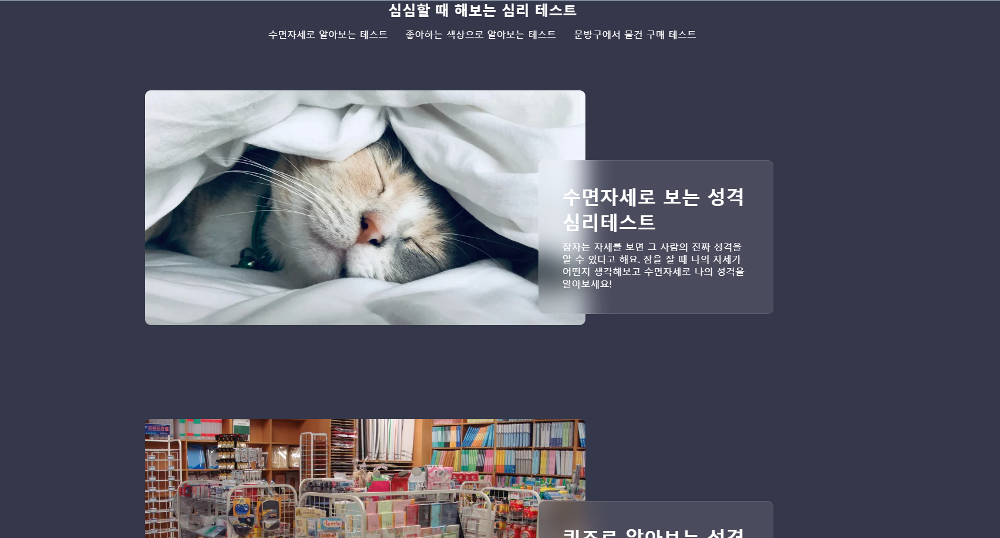

  <h1>✨ 다양한 심리 퀴즈 프로젝트 ✨ </h1>

<!-- Badges -->
<h4>
    <a href="https://randompsychotest.netlify.app">View Demo</a>
</h4>

심심풀이용 간단한 심리 퀴즈들을 통해 사용자의 성향을 알아보는 테스트 입니다. 

서버사이드렌더링의 이해와 NEXT.JS를 이용한 SEO최적화 장점을 이용해보고자 NEXT.JS를 이용했습니다.

 

<!-- About the Project -->

## 💻About the Project

 
  

<!-- TechStack -->

### ⚡Tech Stack⚡

<ul>
   
   
   
   
   
</ul>

<!-- Features -->

### 앞으로 개선사항

    - 반응형 웹 디자인 적용 필요
    - 동일한 layout을 사용하기 때문에 불필요한 코드 정리가 필요

## Acknowledgements

- [Json-server](https://my-json-server.typicode.com/)
